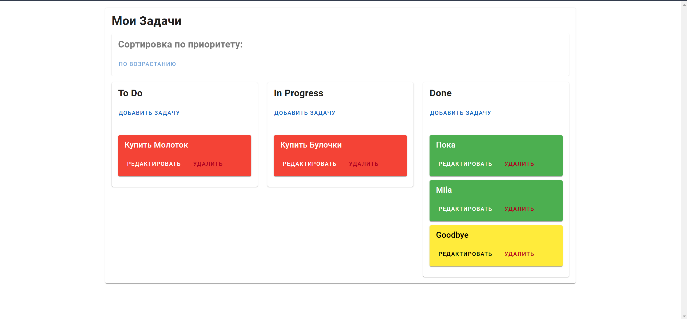
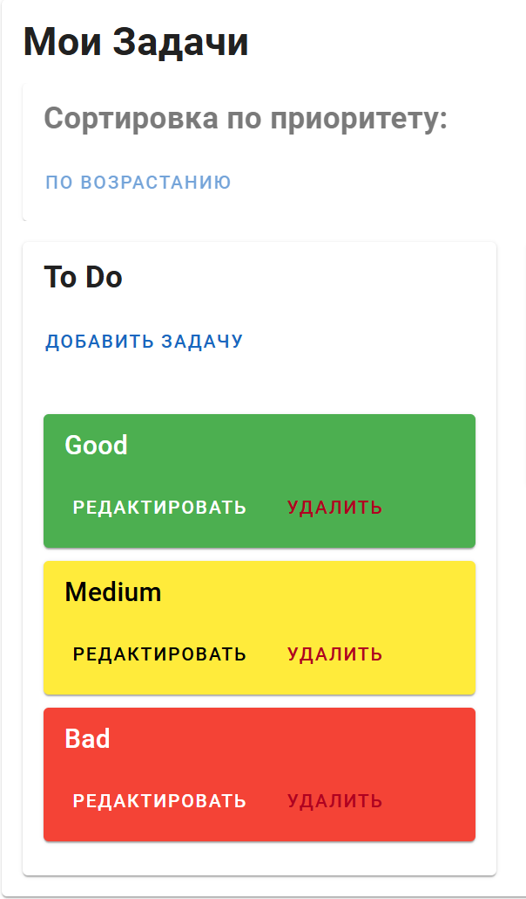
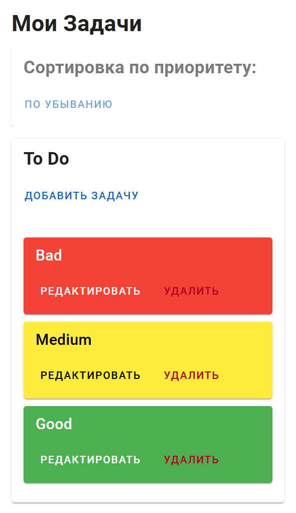
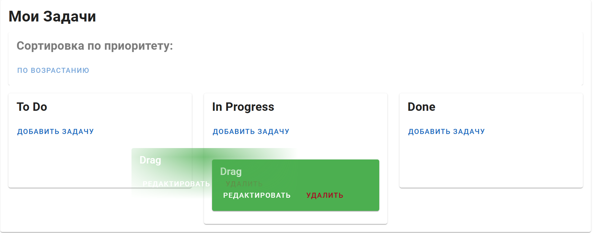
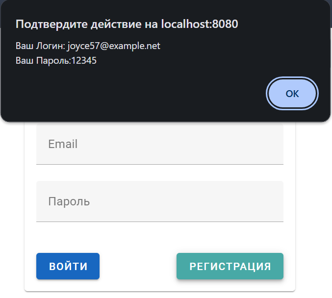

# Login

# Tasks

# Filter Asc

# Filter Desc

# Task Drag

# New User Auth

# Features
New user authorization through Faker   
Task can be dragged between columns  
Task can be edited and deleted  
Authorization using tokens  