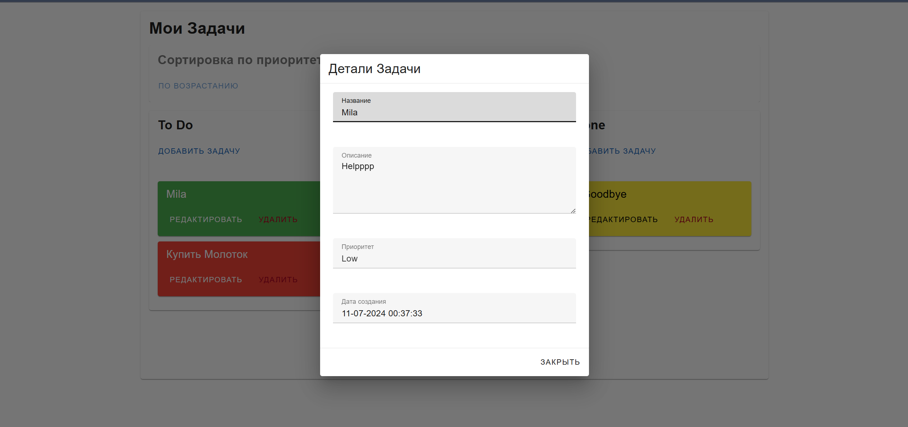
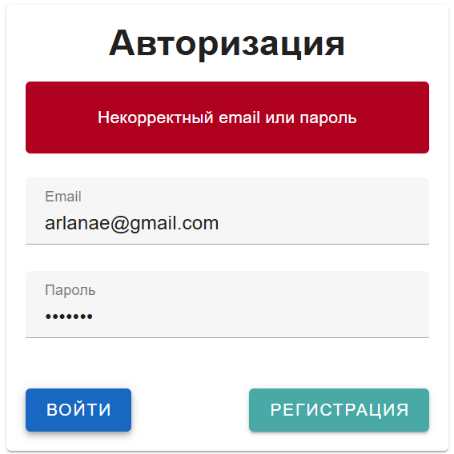

# Login

# Tasks

# Tasks Details

# Filter Asc

# Filter Desc

# Task Drag

# New User Auth

# Failed User Auth

# Features
New user creation through Faker   
Task can be dragged between columns  
Task can be edited and deleted  
Tasks can be filtered by priority  
By clicking on task container, task details is opened  
Authorization error handling  
Authorization using tokens  
